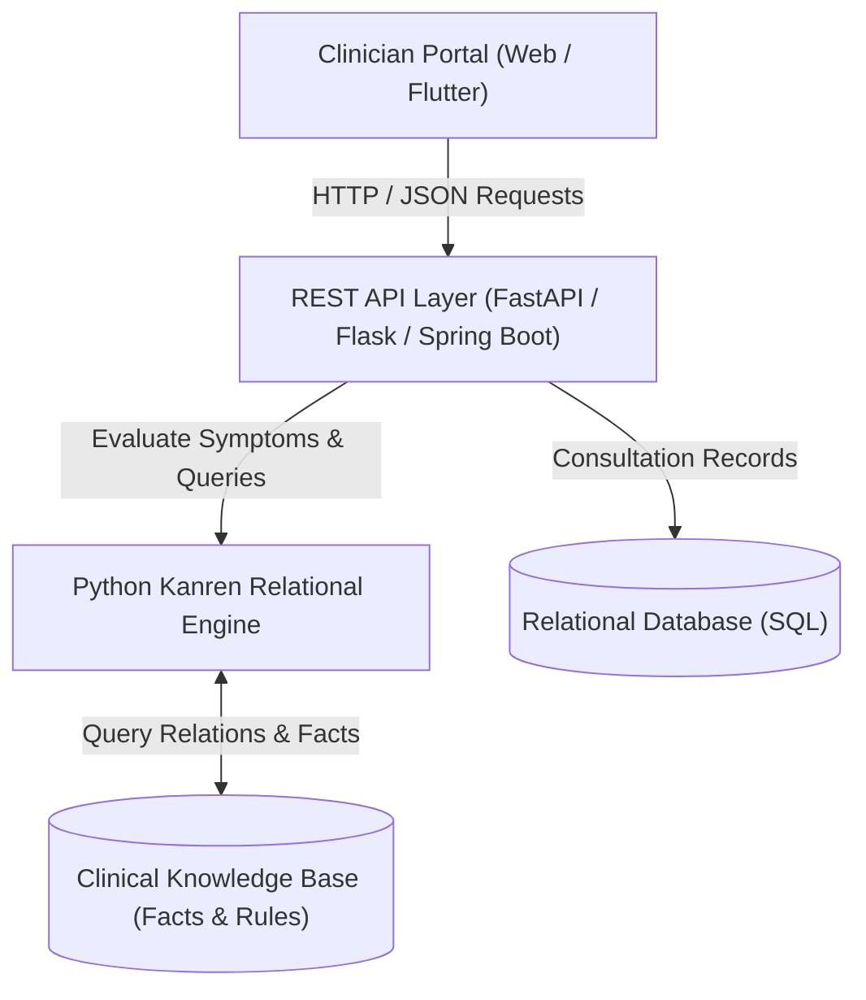

# AegisMed: Medical Diagnosis & Clinical Triage Expert System

[](https://www.python.org/)
[](LICENSE)
[](tests/)
[](#architecture)

A comprehensive, explainable clinical decision-support and expert diagnostic system designed to assist healthcare clinicians and medical students in preliminary triage, differential diagnosis ranking, and laboratory confirmation.

The system combines **declarative relational logic programming (Python Kanren)**, **backward-chained Certainty Factors (CF)**, an **interactive web diagnostic workstation**, a **Java Spring Boot microservice**, and a **cross-platform Flutter client**.

---

## Table of Contents
- [Key Features](#key-features)
- [System Architecture](#system-architecture)
- [Clinical Knowledge Base](#clinical-knowledge-base)
- [Project Structure](#project-structure)
- [Getting Started](#getting-started)
  - [Prerequisites](#prerequisites)
  - [1. Running the Python Expert System Engine](#1-running-the-python-expert-system-engine)
  - [2. Launching the Web Workstation](#2-launching-the-web-workstation)
  - [3. Running the Spring Boot Backend (Optional)](#3-running-the-spring-boot-backend-optional)
- [API Reference](#api-reference)
- [Running Automated Tests](#running-automated-tests)
- [Clinical Triage Workflow](#clinical-triage-workflow)
- [Contributing](#contributing)
- [License](#license)

---

## Key Features

- **Relational Logic Inference Engine**: Powered by Python `kanren` with declarative relations, facts, and rules mapping complex symptom clusters to candidate diseases.
- **Certainty Factor (CF) Uncertainty Modeling**: Implements the classical MYCIN certainty factor model ($CF \in [0.0, 1.0]$) to handle patient uncertainty (*Yes* = 1.0, *Maybe* = 0.5, *No* = 0.0) with early short-circuiting on negative evidence.
- **Explainability Facilities (WHY & HOW)**:
  - **WHY**: Explains why a specific follow-up question is being asked in relation to the active disease hypothesis.
  - **HOW**: Delivers a full mathematical audit trail tracing base rule confidence and symptom confidence factors.
- **Clinician Portal & Workstation**:
  - Secure clinician registration and sign-in with persistent local storage.
  - Collapsible clinician profile sidebar with department and facility context.
  - Multi-system symptom intake across 6 major organ systems (Systemic, Respiratory, Gastrointestinal, Neurological, Dermatological, Cardiovascular).
- **Sequential 3-Disease Triage Algorithm**:
  - Locks the top 3 candidate diseases matching presenting complaints.
  - Evaluates candidates sequentially (least-likely to most-likely) to quickly eliminate lower differentials.
  - Clean binary Yes/No cards with strict 5-item maximum pagination.
- **Definitive Confirmation Testing & Pharmacotherapy**:
  - Direct integration of lab test outcomes (Test Positive / Test Negative).
  - Positive outcomes lock the definitive diagnosis, display recommended medications, and advise cessation of redundant investigations.
  - Negative outcomes advance to the next differential or trigger comprehensive referral advisories.
- **Multi-Tier Architecture**:
  - Web portal (HTML5 / Vanilla CSS / Vanilla JS).
  - Java 17 / Spring Boot consultation and patient record microservice.
  - Flutter cross-platform mobile client.
  - Relational SQL schemas (`database/schema.sql`, `database/data.sql`).

---

## System Architecture



---

## Clinical Knowledge Base

The system covers 50+ acute communicable infections and chronic non-communicable conditions, including:
- **Vector-Borne & Infectious**: Malaria (*Plasmodium falciparum/vivax*), Typhoid Fever (*Salmonella Typhi*), Dengue Fever, Chikungunya, Cholera, Tuberculosis, COVID-19, Pneumonia.
- **Chronic & Systemic**: Type 2 Diabetes, Hypertension, Asthma, COPD, Migraine, Rheumatoid Arthritis, Chronic Kidney Disease.

Each disease record in the knowledge base is enriched with:
- Standardized **ICD-10** diagnostic codes.
- Diagnostic category and clinical description.
- Recommended confirmatory laboratory tests (sample type, test name, urgency).
- First-aid advice, dosage protocols, and specialist referral recommendations.

---

## Project Structure

```
medical_diagnosis/
├── api/
│   └── openapi_spec.yaml             # OpenAPI 3.0 REST specification
├── backend_springboot/               # Spring Boot microservice
│   ├── pom.xml
│   └── src/main/java/com/hospital/expertsystem/
├── database/
│   ├── schema.sql                    # SQL relational schema
│   └── data.sql                      # Seed clinical data
├── documentation/
│   ├── clinical_knowledge_sources.md # CDC/WHO references
│   ├── medical_expert_system_report.md
│   ├── student_documentation.md      # Comprehensive academic report
│   └── system_architecture.md        # Technical architecture design
├── expert_system/
│   ├── main.py                       # REST API Server entry point
│   ├── rule_evaluator.py             # Core rule evaluation logic
│   ├── adaptive_questioner.py        # Question generation engine
│   └── requirements.txt              # Python dependencies
├── frontend_flutter/                 # Cross-platform Flutter client
│   ├── lib/
│   └── pubspec.yaml
├── knowledge_base/
│   ├── facts.py                      # Disease & symptom facts
│   ├── rules.py                      # Logical rules definitions
│   ├── questions.py                  # Clinical inquiry mappings
│   └── kanren_runtime.py             # Kanren relation setup
├── tests/
│   └── test_kanren_engine.py         # Automated unit test suite
├── web_app_live/                     # Live clinician web workstation
│   ├── index.html                    # Clinical workstation markup
│   ├── styles.css                    # Clean medical styling
│   └── app.js                        # Client logic & state management
└── .gitignore
```

---

## Getting Started

### Prerequisites
- **Python**: Version 3.9 or higher
- **Node.js** (optional, for running static file servers)
- **Java 17 & Maven** (optional, for Spring Boot backend)

### 1. Running the Python Expert System Engine

```bash
# Navigate to the expert system directory
cd expert_system

# Create and activate a virtual environment
python3 -m venv venv
source venv/bin/activate  # On Windows: venv\Scripts\activate

# Install required packages
pip install -r requirements.txt

# Start the REST API server
python main.py
```
The expert system REST API will listen at `http://localhost:5000`.

### 2. Launching the Web Workstation

You can open `web_app_live/index.html` directly in any modern browser, or serve it using Python:

```bash
cd web_app_live
python3 -m http.server 8000
```
Open [http://localhost:8000](http://localhost:8000) in your web browser.

### 3. Running the Spring Boot Backend (Optional)

```bash
cd backend_springboot
mvn clean spring-boot:run
```

---

## API Reference

### Health Check
- **`GET /health`**
  - Returns engine operational status and active runtime configuration.

### Knowledge Base Inspection
- **`GET /api/v1/knowledge-base`**
  - Returns disease and symptom taxonomy counts and definitions.

### Run Differential Diagnosis
- **`POST /api/v1/diagnose`**
  - **Body**:
    ```json
    {
      "reported_symptoms": ["fever", "chills", "sweating"],
      "denied_symptoms": [],
      "risk_factors": ["mosquito_exposure"]
    }
    ```
  - **Response**: Array of ranked diagnoses with confidence scores, ICD-10 codes, and recommended tests.

### Generate Targeted Questions
- **`POST /api/v1/next-questions`**
  - **Body**: Candidate disease identifiers.
  - **Response**: Sequenced Yes/No clinical inquiries for secondary signs.

### Process Confirmatory Test Result
- **`POST /api/v1/testing-result`**
  - **Body**:
    ```json
    {
      "candidate_diagnoses": [...],
      "tested_disease_id": "malaria",
      "test_outcome": "positive",
      "eliminated_candidates": []
    }
    ```
  - **Response**: Updated differential pool or confirmed diagnosis protocol.

---

## Running Automated Tests

Run the unit test suite to verify rule evaluation, Certainty Factor calculation, and hypothesis ranking:

```bash
python -m unittest discover tests
```

---

## Clinical Triage Workflow

1. **Authentication**: Clinician logs in with persistent credentials.
2. **Phase 1 (Intake)**: Enter presenting chief complaints, secondary symptoms, and exposure risks.
3. **Phase 2 (Targeted Questioning)**: Answer sequential Yes/No questions focused on candidate conditions (ordered least-likely to most-likely).
4. **Phase 3 (Differential Ranking)**: Review top differential diagnosis, ICD-10 classification, and urgency.
5. **Phase 4 (Laboratory Confirmation)**: Submit lab test outcomes to lock the confirmed diagnosis and display definitive therapeutic guidelines.

---

## Contributing

1. Fork the repository.
2. Create a descriptive feature branch (`git checkout -b feature/clinical-expansion`).
3. Commit your changes (`git commit -m 'feat: add dengue NS1 test rule'`).
4. Push to the branch (`git push origin feature/clinical-expansion`).
5. Open a Pull Request.

---

## License

This project is licensed under the MIT License — see the [LICENSE](LICENSE) file for details.
